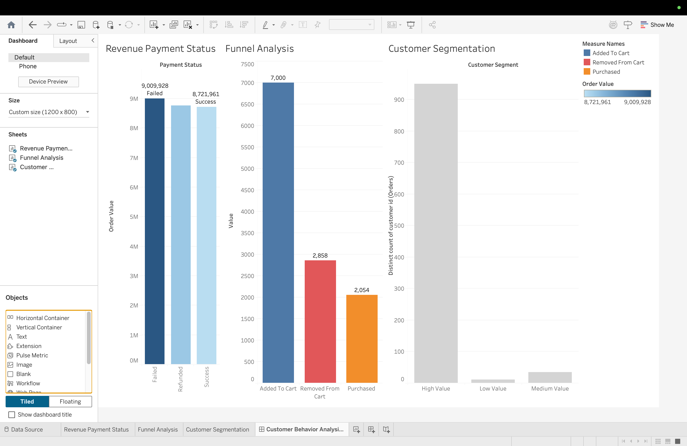

Customer Behavior Analysis Dashboard
Project Overview
This project analyzes customer behavior across different stages of the shopping journey — from adding items to cart to final purchase — and identifies revenue trends, drop-offs, and customer segments.
The goal is to derive insights that can help improve conversion rates and customer experience.

Key Insights
	•	Revenue is highest for Failed transactions, indicating potential payment issues
	•	Significant drop observed between Added to Cart → Purchased
	•	High number of users remove items from cart, indicating hesitation
	•	Majority of revenue comes from High Value Customers

Analysis Performed
1. Revenue by Payment Status
	•	Compared total order value across:
	◦	Success
	◦	Failed
	◦	Refunded
2. Funnel Analysis
	•	Tracked customer journey:
	◦	Added to Cart
	◦	Purchased
	◦	Removed from Cart
	•	Identified drop-off points
3. Customer Segmentation
	•	Segmented customers into:
	◦	High Value
	◦	Medium Value
	◦	Low Value
	•	Based on total order value

Tools & Technologies
	•	SQL (Data Analysis)
	•	Tableau (Dashboard & Visualization)
	•	Excel / CSV (Data Source)

Project Structure
data/ → Raw datasets
sql/ → SQL queries used for analysis
Tableau/ → Tableau dashboard file (.twbx)
README.md → Project documentation

Dashboard Preview

How to Use
	1	Download the .twbx file from Tableau folder
	2	Open in Tableau Desktop / Tableau Public
	3	Explore dashboards and insights

Business Impact
	•	Helps identify revenue leakage
	•	Improves conversion funnel
	•	Enables targeted marketing for high-value customers

Author
Jahnavi
Aspiring Data Analyst | SQL | Tableau | Power BI (Learning)

